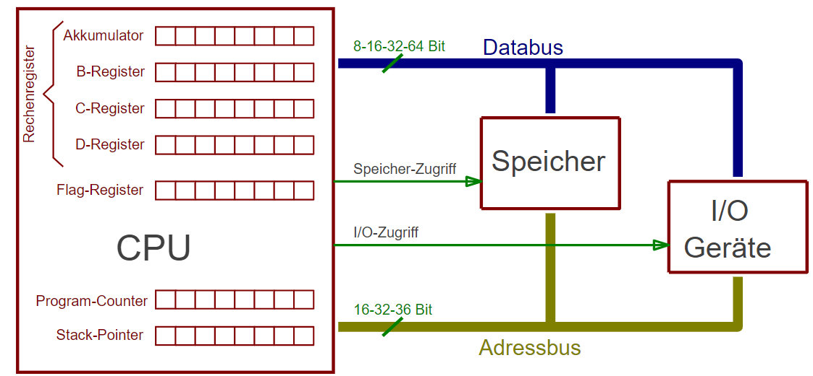

*\*C\*\*entral **P**rocessing **U**nit*

* früher einziges aktives Element in Computern (mittlerweile gibt es meist noch Mikrocontroller z.B. auf dem MB)
* bedient alle Busse:
  * Adressbus
  * Datenbus
  * Steuerbus
* interner Aufbau wird meist durch Register dargestellt, Registerbreite ([Bitbreite](Bitbreite.md)) definiert Grundarchitektur der CPU
  

Bei alten CPUs immer bestimmtes Register bei arithmetischen oder logischen Funktionen involviert (=Akkumulator). Rechenergebnisse landen immer bei Akkumulator. Bei heutigen CPUs geschieht dies nur noch bei speziellen Befehlen. Mittlerweile können mit jedem Register alle Operationen durchgeführt werden.

## Aktueller CPU-Aufbau

Langsamer Speicherzugriff auf Cache ist trotz DDR3 (3 Cache-Ebenen) weiterhin Problem. Lösung durch Versuch des Einbaus nach außen eines 64 Bit Datenbusses. **Dadurch doppelt so schnelle Datenübertragung zwischen CPU und Hauptspeicher.**

Bei modernen CPUs ab 2010 existiert Bus Struktur nur noch innerhalb der CPU. Nach außen gibt es jetzt mehrere Datenbusse und Adressbusse. Adressleitungen sind jetzt multiplexed.

## Fehlende Adressleitungen

Besonderheit bzgl. Adressbussen ab 32-Bit:

* Speicheradressierung immer byteweise
* Bei 32 Bit immer gleich 4 Bytes

:arrow_right: die untersten Adressleitungen werden bei 32-Bit Prozessor nicht mehr benötigt, da immer 3 Bytes übersprungen werden

Für einzelne Adressierung der Bytes: Busleitung "Byte Enable" BE0# - BE3#; bei 64-Bit BE0# - BE7#

## Takt und Timing

Erste Computer genau ein Systemtakt durch Taktoszillator (Quarzoszillator). Mittlerweile Takt in CPU höher durch Taktvervielfachung (mittels PLL umgesetzt).
Speichercontroller (Cache-Controller) in CPU kümmert sich um Entkopplung der unterschiedlich schnellen Busse.

Maximale Taktfrequenz bereits ca. 2000 erreicht (200-300 MHz). Mittlerweile Übertragung von 4 statt einem Datenwort um trotzdem schnellere Datenübertragung zu ermöglichen.

\#rechnerarchitekturen #systemaufbau
