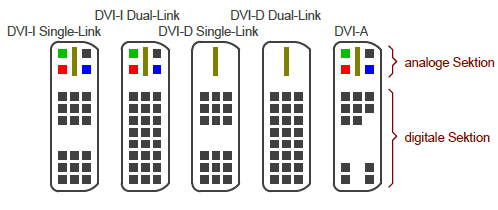

*Digital Visual Interface*

* VGA (analog nicht für erste Flachbildschirme geeignet) 

 > 
 > Video Graphics Array (**VGA**) is a video display controller and accompanying de facto graphics standard, first introduced with the IBM PS/2 line of computers in 1987, which became ubiquitous in the PC industry within three years. The term can now refer to the computer display standard, the 15-pin D-subminiature VGA connector, or the 640×480 resolution characteristic of the VGA hardware.VGA was the last IBM graphics standard to which the majority of PC clone manufacturers conformed, making it the lowest common denominator that virtually all post-1990 PC graphics hardware can be expected to implement.
 > 
 > The VGA analog interface standard has been extended to support resolutions of up to 2048×1536 and even higher in special applications.
 > 
 > [Wikipedia](https://en.wikipedia.org/wiki/Video%20Graphics%20Array)

* digitale Schnittstelle (synchrone, symmetrische Übertragung)
* 6 einzelne differenzielle Signale
* auch synchrones Clock-Signal symmetrisch übertragen
* max. Kabellänge: 10m
* für Rückwärtskompatibilität 4 analoge Signale (RGB+H-Sync) über Stecker übertragbar
* Übertragung ausschließlich gleichanteilsfrei ➡:arrow_right: Übetragung gleicher Anzahl von 0 und 1
* **Steckertypen:**
  * DVI-D :electric_plug: nur digitale Leitungen genutzt
  * DVI-A :electric_plug: nur analoge Leitungen genutzt
  * DVI-I :electric_plug: digitale und Analoge genutzt
    

\#rechnerarchitekturen #displays 
