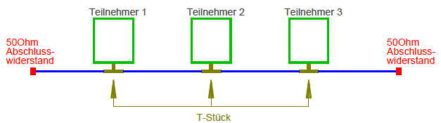
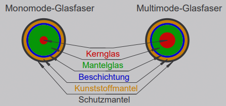
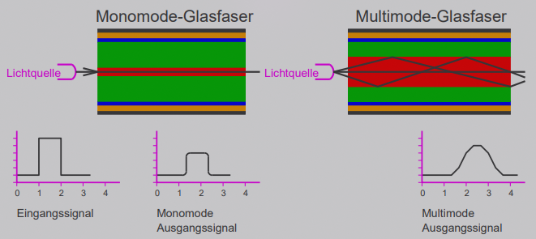

* aus physikalischen Gründen immer serielle Verbindungen (wegen Leitungslängen)
* **Ethernet** hat sich als Standard im Laufe der Zeit durchgesetzt

## Koaxial

* nur Zuverlässig mit weniger als 10 Teilnehmern (1 Übertragungsmedium, mehrere Sender senden zeitgleich)
* sehr fehleranfällig da nur 1 Kabel
* max. Geschwindigkeit: 10MBit/s (mit allen Teilnehmern geteilt & nur halbduplex)
* max. Leitungslänge zwischen 2 Teilnehmern: 185 m
* Pegel zwischen 0 und -2,2V (Manchester-Kodierung)

## Twisted Pair 2x2

* anfangs CAT3-Kabel
* Stecker: RJ45
* Pegel: ±2,5V (mit aktiven Geräten wie Hub/Switch)
* symmetrisch und full-duplex (ein Pair pro Richtung)
* Geschwindigkeit mit CAT5-Kabel: 100MBit/s (mit *PAM-3* Pegel +1V/0V/-1V)

## Twisted Pair 4x2

* Geschwindigkeit: 1GBit/s
* nutzt alle 4 Adernpaare zeitgleich (fullduplex)
* 5 Signalpegel (*PAM-5*): +1V/+0,5V/0V/-0,5V/-1V (Steigerung des Durchsatzes um den Faktor 2,5)
* andere Geschwindigkeiten (2,5/5/10 Gbit/s) arbeiten mit 16 Pegelstufen (*PAM-16*)

## Glasfaser

* optisch
* erst ab 1GBit/s sinnvoll (wegen teuer Technik)
* Durchmesser je nach Fasertyp bei ca. 100-200µm
* **Monomodeglasfasern:**
  * bei Entfernungen bis weniger 100m sinnvoll
* **Multimodeglasfasern:**
  * für Entfernungen von wenigen Kilometern sinnvoll

* Licht im Infrarot-Bereich (850nm-1550nm)
* Übertragung in Fullduplex
  * normalerweise 1 Faser pro Richtung
  * auch mit nur 1 Faser möglich (durch unterschiedliche Wellenlängen für die Richtungen möglich)

* Umwandlung von Kupfer auf Glasfaser mittels Medienkonverter (1GBit/s)
* ab 10GBit/s Transceiver Module direkt in Netzwerkport

\#rechnerarchitekturen #netzwerke 
