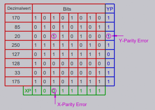

*Error Correction Code*

* Weiterentwicklung von [Parity](Parity.md) zur Erkennung der Stelle des gekippten Bit
* Erweiterung der Prüfsumme in 2. Dimension (Matrix/Array)

\#rechnerarchitekturen #fehlerkorrektur 
