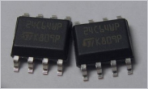

*Electrically Erasable Programmable Read Only Memory*

* Unterschied zu [EPROM](EPROM.md): 
  * **Schreiben** erfolgt elektronisch durch intern erzeugte höhere Schreib-Spannung (ca. 15V)
  * **Löschen** je nach Hersteller unterschiedlich (z.B. größere negative Spannung am Control-Gate, positive Spannung am Drain Anschluss oder separater MOSFET)

## Parallel (*28xxx*)

* beliebter Ersatz für EPROMS da Pinkompatibel.
* Löschen einzeln oder in kleinen Blöcke möglich
* fast ausgestorben, da durch [Flash](Flash.md)-Bausteine ersetzbar

## Seriell

* heute oft in Embedded-Systemen verwendet
* Löschen fast jeder Speicherzellen einzeln und mehrere 100.000 mal möglich
* Dauer von Speichern inkl. Löschen im Millisekunden Bereich
* 8-Polige Bauform
* häufige Nutzung z.B. auf DRAM-Modul als Speicher für Referenzdaten (Versorgungsspannung, Speicherkapazität, Timing, Refresh-Daten)

\#rechnerarchitekturen #rom 
