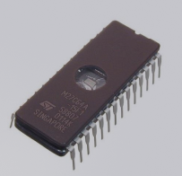

*Erasable Programmable Read Only Memory*

* **Vorteil**: löschbar mit UV-Licht (gegenüber [ROM](ROM.md)), allerdings nur einige 100x
* Löschdauer: ca. 20min, zerstört nach und nach die Kristallstruktur des Quarzglases (da normales Glas nicht UV-durchlässig ist); UV-Strahlung liegt bei 254 nm
* EPROM ohne Fenster :left_right_arrow: PROM
* Specs:
  * Datenbusbreite 8-Bit
  * Größen zwischen 64kB und 8MB

\#rechnerarchitekturen #rom 
