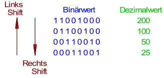

Division oder Multiplikation mit dem Faktor $2^x$ entspricht Shift-Operation um $x$ Bit (also z.B. um $1$ Bit bei $\cdot\space2^1$).

Viele Compiler erkennen diese Funktion und setzen $2^x$ automatisch durch Shift-Befehl um. 
**Operations-Dauer**: üblicherweise nur 1 Taktzyklus

\#rechnerarchitekturen #rechenwerk 
