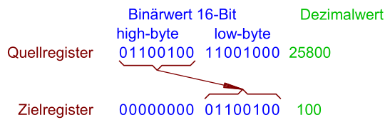

Da diese Operation einer **Shift-Operation um 8-Bit** entsprechen würde, führen fast alle modernen Compiler in diesem Fall gar keine Operation durch. 
**Ein Compiler greift stattdessen auf die Adresse der zu multiplizierenden Variablen um 1 Byte versetzt zu.**
*Operation in $0$ Taktzyklen möglich*

\#rechnerarchitekturen #rechenwerk 
