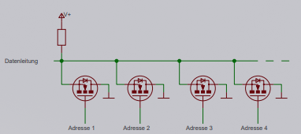
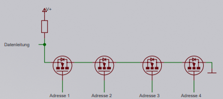
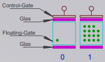
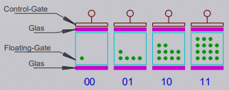
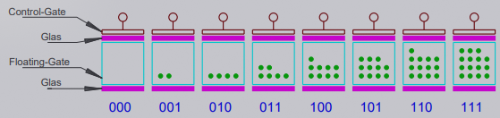
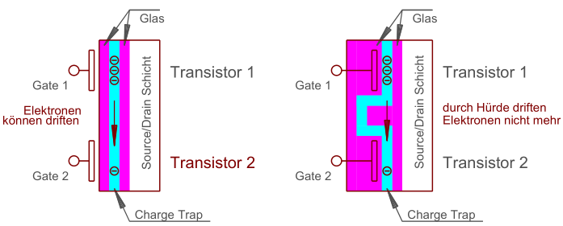

Unterscheidet sich zum [EEPROM](EEPROM.md) durch Aufbau

## NOR-Flash

* Ausführung der einzelnen Zellen als Matrix mit wahlfreiem Zugriff
* Zugriff über Adress-Wortleitung :arrow_right: direkte Verbindung von Ein-/Ausgang mit der Zelle

## NAND-Flash

* Hintereinanderschaltung von Zellen in Gruppen
* für Zugriff müssen alle Nachbarzellen in der Gruppe durchgesteuert werden
* geringere Störsicherheit bzw. Zuverlässigkeit
* nur 1/10 der Haltbarkeit von NOR-Flash-Zellen, dafür allerdings auch nur 1/10 der belegten Chipfläche

|Eigenschaft|NOR|NAND|
|-----------|---|----|
|wahlfreier Zugriff|ja|nein|
|Löschgeschwindigkeit|langsam|schnell|
|Fläche pro Zelle|groß|klein|
|Zuverlässigkeit|hoch|niedrig|
|typische Verwendung|Programmspeicher in Mikrocontrollern|USB-Sticks, Speicherkarten, Festplatten (meist SSD)|

## SLC MLC TLC QLC

Traditionell speichert eine Flash-Zelle genau **1 Bit** (*SLC*):

Um mehr als 1 Bit pro Zelle speichern zu können, hat man ab ca. 2010 sog. **Füllstufen** verwendet um zuerst **2 Bit (mit 3 Füllstufen + 0)** zu speichern (*MLC*):

Später konnte man dann mit **7 Füllstufen** sogar **3 Bit** speichern (*TLC*):

Um beim Auslesen die Füllstufen unterscheiden zu können benötigt man bei mehr Füllstufen auch aufwändigere Fehlerkorrektur :arrow_right: **Anzahl der Löschzyklen sinkt**

## 3D-NAND Flash

Speicher an Grenzen gekommen, Transistoren können nicht enger aneinander platziert werden ohne Leckströme zu verursachen. Lösung: Erweiterung in die 3. Dimension (Höhe)

* Floating Gate aus Siliziumnitrid jetzt *Charge Trap*
* Hürde zwischen Transistoren verhindert Driften von Elektronen

\#rechnerarchitekturen #rom 
