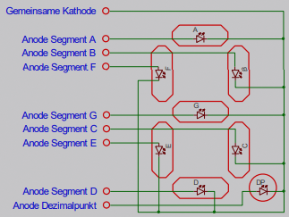

## Einfache Matrix

* verwendet für größere Zahl an LEDs ([Leuchtdioden](Leuchtdioden.md))
* gemultiplexte Matrix
  
* LEDs immer nur kurz an
* kurzzeitig sehr hoher Strombedarf (bis zu einigen Ampere) um ausreichende Helligkeit zu erreichen

## 7-Segment

* meist mehrstellig
* 2 Versionen:
  * Gemeinsame-Kathode
    
  * Gemeinsame-Anode
    
* durch gemeinsamen Anschluss kann 8-facher Strom fließen :arrow_right:  Ausgangspins des anzusteuernden ICs mit Transistoren verstärken
  * Variante gemeinsame Anode besser geeignet (Ausgangspins von Mikrocontrollern i.d.R stark genug um Kathoden der LEDs ohne Transistor direkt anzusteuern)
  * Versorgung des Mikrocontrollers muss mit der Versorgung der LEDs übereinstimmen (Transistoren funktionieren sonst nicht)

\#rechnerarchitekturen #displays 
