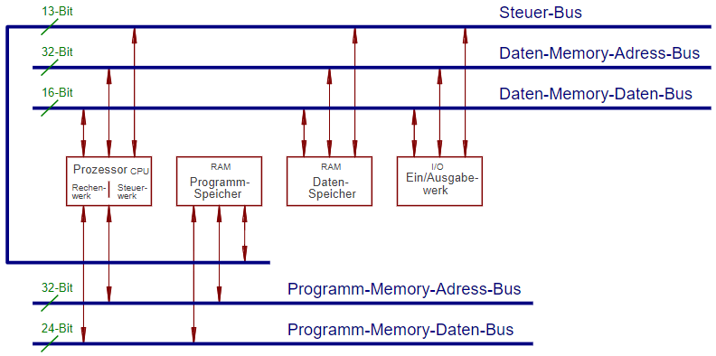

1944 von *IBM* und *Harvard-Universität* entwickelt. Hauptmerkmal ist die **physikalische Trennung von Speicher und Bussen für Daten und Programmcode**.

:heavy_plus_sign: *Vorteile:*

* Zugriff auf den Speicher bei der Befehlsabarbeitung (theoretisch) doppelt so schnell
* Überschreiben des eigenen Codes durch ein laufendes Programm nahezu unmöglich

|Systemtyp|Programmspeicher|
|---------|----------------|
|"normal"|Nur-Lese-Speicher (read-only)|
|embedded|ROM-Speicher|

Modifizierte Version (*Modified-Harvard*) z.B. bei Cache in modernen Systemen implementiert (verhindert Cache-Trashing, siehe [Von-Neumann-Architektur](Von-Neumann-Architektur.md)).

\#rechnerarchitekturen 
