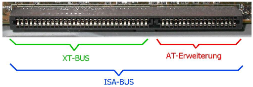

*\*I\*\*ndustry **S**tandard **A**rchitecture*

Erstes firmenübergreifendes BUS-System für Standard-PCs entwickelt von *IBM* in den 1980er Jahren. 

|Version|Bus-Breite|Taktfrequenz|
|-------|----------|------------|
|1|8 Bit|4,7 MHz|
|2|16 Bit|8,33 MHz (Übertragungsrate: 16,6 MB/s)|

Der gesamte Systembus wird direkt auf den ISA-Stecker geführt. 
*Spätere Weiterentwicklung mit 32 Bit hat sich nicht durchgesetzt.*

Es werden immer noch Rechner für Industrieanwendungen mit einem ISA-Slot-System hergestellt, um bereits vorhandene (teure) ISA-Karten weiterverwenden zu können. (allerdings nur mit ISA-Hardware-Emulation)

\#rechnerarchitekturen #bus-systeme
