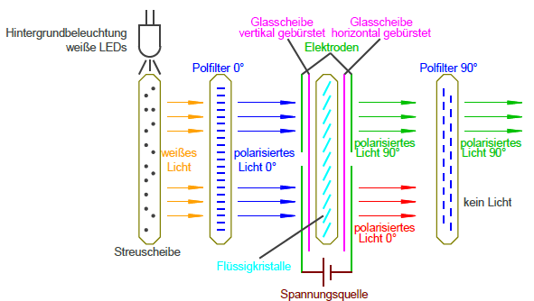
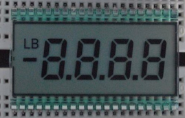

*Liquid-Crystal-Display* (**LCD**)

* basiert auf Flüssigkristallen, die Polarisationsrichtung des (Hintergrund-)Lichts beeinflussen
* Beispiel TN-Zelle (*Twisted Nematic*)
  
* bei erstem Polfilter gehen 50% des Lichts verloren (übrig bleibt nur polarisiertes Licht)
* Flüssigkristalle zwischen 2 Glasplatten drehen Polarisation des Lichts um 90°
* 
  2. Polfilter lässt nur das auf 90° polarisierte Lich durch
* **Spannung an Zelle (Pixel) :arrow_right: keine Drehung des 0° Lichts :arrow_right: Licht wird durch 2. Polfilter geblockt (*Pixel aus*)**
* Lichquelle:
  * bis 2010 Kaltkathodenleuchtstofflampen mit Quecksilberdampf
  * heute weiße LEDs (etwas bessere Farbdarstellung)
* Farbdarstellung erfolgt durch Farbfilter zwischen 1. Polfilter und 1. Glasplatte 
  * lässt wegen RGB nur 1/3 des weißen Lichts durch :arrow_right: verringerte Effizienz/Helligkeit (-2/3)
  * Lösung (bei **QLED**): blaues Licht als Hintergrundbeleuchtung; Konvertierung für **R**ot und **G**rün erfolgt durch Fluoreszenzstoffe, oder mit Quantenpunkten
  * Next-Gen: Farbkonvertierung nach Polarisations-Drehung

## Passive LCDs

* normalerweise ohne Farbdarstellung
* nur 2 Helligkeitszustände pro "Pixel" (Ein/Aus)
* **Vorteile**: preisgünstig und einfaches Ansteuern
* wichtig: keine dauerhafte Gleichspannung an Segmente anlegen (zerstört die Flüssigkristalle langsam)
  * Lösung: pulsierende Gleichspannung mit max. 1kHz verwenden

## LCDs mit integrierter Ansteuerung

"aktive LCDs"

* Standard-Controller hat 4-Bit-Modus, der Ansteuern mit nur 7 Leitungen zulässt
* Kontrastleitung fordert meist echte einstellbare negative Spannung (über Ladungspumpe erzeugbar)
* neue LCD-Module haben SPI-Schnittstelle 

 > 
 > The **Serial Peripheral Interface** (SPI) is a synchronous serial communication interface specification used for short-distance communication, primarily in embedded systems. The interface was developed by Motorola in the mid-1980s and has become a de facto standard. Typical applications include Secure Digital cards and liquid crystal displays.
 > 
 > SPI devices communicate in full duplex mode using a master-slave architecture usually with a single master (though some Atmel devices support changing roles on the fly depending on an external (SS) pin). The master (controller) device originates the frame for reading and writing. Multiple slave-devices may be supported through selection with individual chip select (CS), sometimes  called slave select (SS) lines.
 > 
 > Sometimes SPI is called a four-wire serial bus, contrasting with three-, two-, and one-wire serial buses. The SPI may be accurately described as a synchronous serial interface, but it is different from the Synchronous Serial Interface (SSI) protocol, which is also a four-wire synchronous serial communication protocol. The SSI protocol employs differential signaling and provides only a single simplex communication channel. For any given transaction SPI is one master and multi slave communication.
 > 
 > [Wikipedia](https://en.wikipedia.org/wiki/Serial%20Peripheral%20Interface)

\#rechnerarchitekturen #displays 
