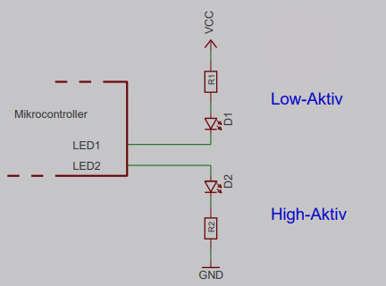

* Ansteuerung bereits mittels einzelnem Port-Pin (Mikrocontroller) möglich:
  * High-aktiv
  * Low-aktiv
    
* Low-aktiv meist besser geeignet wegen mehr Strom am Digitalausgang
* manche LED-Farben (z.B. blau, was auch in weißen enthalten ist, oder *True-Green*) haben höheren Spannungsbedarf (>3V) als Mikrocontroller mit 3V Versorgungsspannung

\#rechnerarchitekturen #displays
