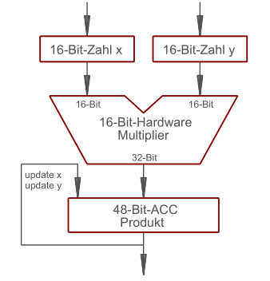

***M**ultiply **AC**cumulate*
Für Berechnung von Fourier-Transformation $$z=z+(x\cdot y)$$ haben Signalprozessoren eine [MAC](MAC.md)-Einheit

* Multiplikation ist oft breiter als die Ergebnisbreite des Multipliers
* Eingangswerte $x,y$ des Multipliers können bei den meisten Signalprozessoren mit automatischem Zeiger auf nächsten Multiplikator weitergeschaltet werden

\#rechnerarchitekturen #rechenwerk 
