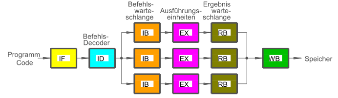

Gewisse Befehlsabfolgen lassen sich schlecht mit einer oder mehreren Pipelines ([Pipelining](Pipelining.md)) parallel verarbeiten Lösung ➡️ Vertauschen von Befehlsreihenfolgen ➡️ bessere Ausnutzung von Pipelines

Befehle werden in Warteschlange (Instruction Buffer) eingereiht. Befehlsdecoder prüft mit Heuristik, ob Befehl vorgezogen werden kann, wenn Execution Unit frei ist

Nach Ausführung werden Ergebnisse in **R**e-order-**B**uffer eingereiht und in Ursprungs-Reihenfolge zurück an Speicher oder Ergebnisregister übergeben.

\#rechnerarchitekturen #steuerwerk 
