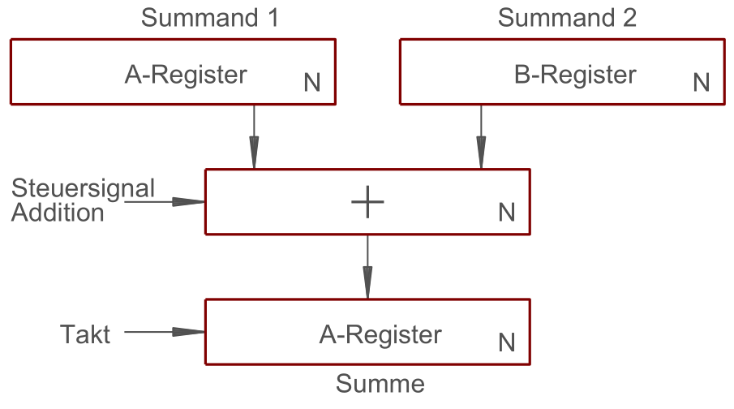

Kompletzte Addition zweier Register:

1. Sumanden in Registern mit der Breite N
1. Steuersignal in Addition aktiviert das Paralleladdierwerk
1. Mit nächster Taktflanke wird Ergebnis dann is das A-Register übernommen

Für eine Subtraktion, wird bei Subtrahend (B-Register) noch ein Zweierkomplement zwischengeschaltet

## Ripple Carry

Bei Addition mehrstelliger Zahlen, wird pro Dualstelle ein [Volladdierer](Volladdierer.md) benötigt.

\#rechnerarchitekturen #addierer #rechenwerk 
