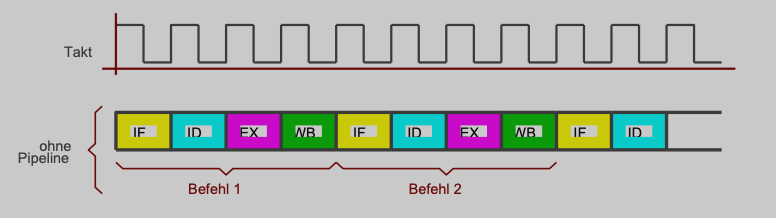
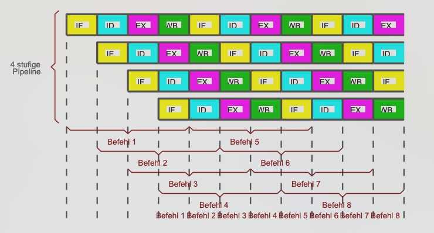

Prozessoren sind in Verarbeitungsklassen unterteilbar:

|Verarbeitungsklasse|Assemblerbefehle / Taktzyklus|
|-------------------|-----------------------------|
|nicht skala|\<1|
|skalar|1|
|superskalar|\>1|

(vereinfacht) 4 Verarbeitungsschritte pro Befehl:

1. Befehl hohlen (IF - **I**nstruction **F**etch)
1. Befehl dekodieren (ID - **I**nstruction **D**ecoding)
1. Befehl ausführen (EX - **EX**ecution)
1. Befehl wegschreiben (WB - **W**rite **B**ack)

Mit Pipeline ist es möglich, dass der Prozessor pro Taktzyklus einen Assemblerbefehl abarbeiten kann (skalar):

## Fazit

Zusammenspiel von ...

* mehrfachen Pipelines ([Pipelining](Pipelining.md))
* mehrfachen pipelineübergreifenden Execution-Units
* [Out Of Order Execution](Out%20Of%20Order%20Execution.md)
* Branch-Prediction-Unit ([Branch Prediction](Branch%20Prediction.md))
* Speculative Execution

... sorgt für Performance Steigerung

Alle Optimierungen Zusammen bilden Sicherheitslücke (Stichwörter: Spectre, Meltdown).

\#rechnerarchitekturen #steuerwerk
