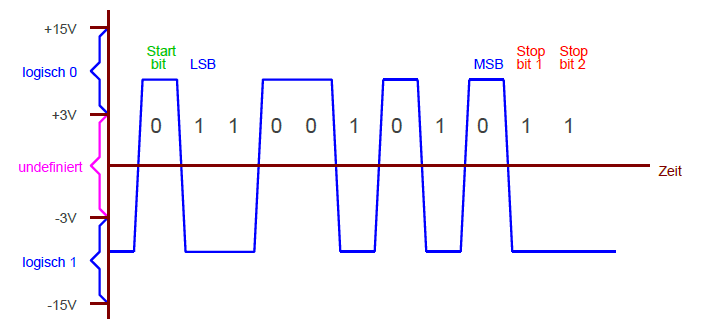
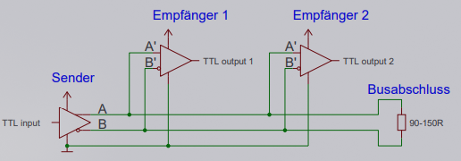
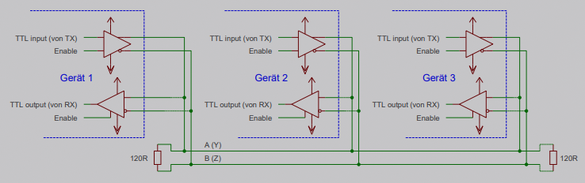

***R**ecommended **S**tandard*

* **RS232** entwickelt in den 1960er Jahren (für DFÜ auf Telefonleitungen)
* Nutzung heute nur noch in Mikrocontroller-Programmierung und Industriebereich (vor allem Übertragungsarten **RS422** und **RS485**)

## RS232

* asynchron, seriell, full duplex in Negativ-Logik (:arrow_up: 0 | :arrow_down: 1)
* Übertragung durch Spannungspegel
  * logisch 1 = 0V
  * logisch 0 = 3V
    
* verbreitete Abwandlung: **RS232-TTL** (Umwandlung mittels Baustein *MAX232* von *MAXIM*)

### Leitungen

heutige 4 wichtigste Leitungen:

* TX :electric_plug: Sendeleitung
* RX :electric_plug: Empfangsleitung
* RTS :electric_plug: Bereit zum Senden
* CTS :electric_plug: Bereit zum Empfangen

Heute hat RS232 Schnittstelle 9 Leitungen, minimal notwendig sind 2 (TX & RX).

### Synchronisation und Timing

... erfolgt über immer vorhandenes Startbit und bis zu 2 Stoppbits.
Vor Übertragung muss festgelegt werden, wie lang (zeitlich) der Abstand zwischen 2 gesendeten Bits sein soll. Typische Übertragungsraten (**Baud-Rates**):

|Bit/Sekunde|max. Leitungslänge (Meter)|
|-----------|---------------------------|
|2400|900|
|4800|300|
|9600|150|
|19200|15|
|57600|5|
|115200|\<2|

:arrow_right: *je höher Baud-Rate, desto niedriger max. Leitungslänge*

### UART

*Universal Asynchronous Receiver Transmitter*

* sitzt zwischen Schnittstelle und CPU
* übernimmt parallel-seriell-Wandlung
* oft in Mikrocontrollern integriert

### Handshake

... soll den Datenverlust bei Übertragung verhindern.
Arten:

* **Software-Handshake**
  Empfänger sendet ***Xon*** und ***Xoff*** Zeichen um Sender anzuhalten oder wieder fortsetzen zu lassen
* **Hardware-Handshake**
  Übertragung wird über RTS/CTS Leitungen angehalten und wieder fortgesetzt

## RS422

* Weiterentwicklung von *RS232*
  * nutzt das selbe Bitmuster
* voll-duplex, symmetrisch
* 2 Leitungen pro Richtung
* Spannung: ±5V (mit Definitionslücke zwischen +0,2V und -0,2V)
* max. Leitungslänge: 1200m
* max. Übertragungsrate: 10MB/s
* Abschlusswiderstand ab 200kB/s notwendig
* Kabelqualität hat großen Einfluss auf max. Kabellänge und Übertragungsrate
  * Vorteil durch Verdrillung der beiden sym. Adern (Twisted Pair)
  * *Empfohlen: CAT5 (sonst für Ethernet verwendet)*

## RS485

* Überführung der RS422 Schnittstelle in Halbduplex
* Zusammenschaltung von bis zu 32 Geräten (mit speziellen Treibern auch 265) möglich
* Wegen Halbduplex muss Sendeverstärker jedes Geräts abgeschaltet werden können

### Bezugsleitung

* grundsätzlich kein Strom auf *GND-Bezugsleitung* (wegen umgekehrter gegenphasigen Polarität der 2 Signale)
* Geräte erhalten Bezugspotential über das Erdpotential (-7 bis +12 V erlaubt)
* bei großen Leitungslängen sollte Bezugsleitung mitgeführt werden (*Erdpotenziale können zu unterschiedlich oder verrauscht sein*) um Störungen zu vermeiden

### Busabschluss

* es ist möglich dass kein Sender aktiv ist (da Sender abschaltbar)
* wenn auch noch nur $120\Omega$-Widerstand genutzt wird, kann Leitungspegel auf undefinierten Zustand von 0V fallen (manche Empfänger schwingen dann - *Zufallsgenerator*)
* **Lösung: Failsafe-Busabschluss** (bleibt ohne Treiber auf einem definierten Pegel stehen)

### Neuere Versionen

* neuere RS485-Komponenten verzichten auf den negativen Teil in Spannungspegeln
* Signale jetzt zwischen +5V und 0V

\#rechnerarchitekturen #serielle-schnittstellen
