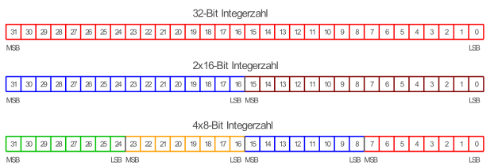

Normalerweise kann in einem Register der [CPU](CPU.md) nur eine Operation auf den gesamten Registerinhalt angewandt werden **SISD** (***S**ingle **I**nstruction **S**ingle **D**ata*). :arrow_right: bei 16-Bit-Operationen 75% des 64-Bit-Registers ungenutzt

**SIMD**-Betrieb (***S**ingle **I**nstruction **M**ultiple **D**ata*) um Registerbreite voll zu nutzen: Teilung des Registers in mehrere Teile, Einzelteile werden dann wie separate Register behandelt. :arrow_right: bei 64-Bit bis zu 8x 8-Bit-Berechnung zeitgleich möglich

\#rechnerarchitekturen #rechenwerk 
