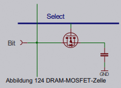

***D**ynamic **R**andom **A**ccess **M**anagement*

Speicher basiert auf einem kleinen Kondensator, in dem Bit Wert mittels elektrischer Ladung gespeichert wird. 
**Vorteil**: nur ein Transistor zur Bit Speicherung nötig

* Größe heutzutage im Gigabit Bereich
* Kondensator entlädt sich von selbst
* vor jedem Verlorengehen muss Inhalt ausgelesen werden
* zyklisches Auslesen im Refresh Zyklus

Darstellung des DRAM-Speichers in einem 2-Dimensionalen Array:

* Wortleitung
* Bit-Leitung

Zugriff auf Kondensator erfolgt über 2 Address-Teile:

* RAS (**R**ow-**A**dress-**S**elect, Zeilenadresse)
* CAS (**C**olumn-**A**dress-**S**elect, Spaltenadresse)

:timer_clock: **Zugriffdauer heutzutage im Bereich 40-60 nS mit Zugriffstaktfrequenz von 16-15 MHz, andert sich nur ein Adressteil, halbiert sich die Zugriffszeit (20-30 nS)**

## Parallelschaltung

* Führt bei manchen Rechner-Designs zu einer Überlastung des Adressbusses
  * Kann verhindert werden, indem vor Adressleitungen der Bausteine auf RAM-Modul ein zusätzlicher Buffer geschaltet wird ➡️ *Bufferd-RAM*
  * Wenn zusätzlich noch Zwischenspeicher (Latch) für Adresse vorgeschaltet wird, spricht man von *Registered-Ram*

\#rechnerarchitekturen #dram
