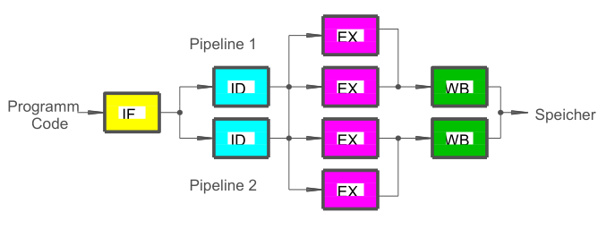

Weiterentwicklung der Pipeline ([Pipelining](Pipelining.md)) durch die diese doppelt ausgeführt werden kann. Ergebnis sind min. 2 Befehle pro Takt (ab *Intel* **Pentium** aus 1933).

Moderne Prozessoren verwenden heutzutage oft eine Kombination aus mehreren Pipelines und Ausführungseinheiten (Execution-Units).

\#rechnerarchitekturen #steuerwerk 
