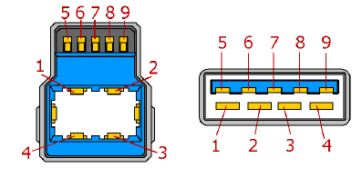

*USB3.0*

* Erhöhung der Geschwindigkeit von [USB](USB.md)2.0
* Erweiterung des Steckertyps um 5 Datenleitungen (2 differenzielle-fullduplex-Paare + extra Masse | 4 :arrow_right: 9):
  

|Pin|Name|Beschreibung|
|---|----|------------|
|1|VBUS|+5V|
|2|D+|differentielles Paar 1+|
|3|D-|differentielles Paar 1-|
|4|Masse|0V|
|5|SSTX-/SSRX-|differentielles Paar 2- TxRx|
|6|SSTX+/SSRX+|differentielles Paar 2+ TxRx|
|7|Masse|Masse für differentielles Paar 2|
|8|SSRX-/SSTX-|differentielles Paar 2- TxRx|
|9|SSRX+/SSTX+|differentielles Paar 2+ TxRx|

* Rückwärts- und Vorwärtskompatibilität erhalten
* Kennzeichnung der USB3-Stecker durch blaue Farbe
* **neue Übertragungsrate: 5GBit/s** (*Super-Speed-USB*)
* Stromverfügbarkeit von 0,5A auf 0,9A (beides bei 5V) erhöht :arrow_right: max. Leistung jetzt 4,5W
* **max. Kabellänge: 3m**

## USB3.1/3.2

* große Änderung: **Typ-C als Steckertyp** (keine mechanische Rückwärtskompatibilität mehr) der in beide Richtungen einsteckbar ist
* 4 Halbduplex Super-Speed-Leitungspaare
* **USB3.1:**
  * Typ-C
  * selber Steckertyp für beide Seiten (Host/Client)
  * 24 Leitungen pro Kabel
  * höhere Übertragungsrate: **SuperSpeed+** (10GBit/s)
  * verschiedene Spannungen möglich (z.B. *USB Power Delivery* aka **USB-PD**), allerdings erst nach Aushandeln auf 5V:
    * 5V
    * 12V
    * 20V
  * max. Leistung: 100W
  * max. Kabellänge nur noch 1m
  * elektrische Rückwärtskompatibilität weiterhin vorhanden (z.B. mit Adaptern)
* **USB3.2:**
  * definiert ca. 2017
  * durch Ausnutzung weiterer Leitungen im Kabel noch schneller: 20GBit/s (SuperSpeed USB 20Gbps)

\#rechnerarchitekturen #serielle-schnittstellen 
