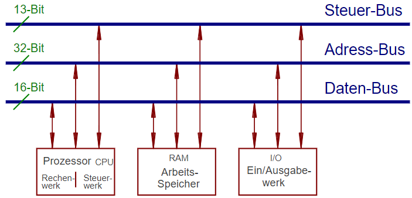

1945 definierte Computerarchitektur, die in fast allen modernen Systemen verwendet wird.

*Das erste System mit dieser Architektur war **1936** der vollmechanische Z1 von Konrad Zuse.*

## Konzept

**Ein einziges Bussystem für alle möglichen Datentypen** (z.B. Dateien oder Programmbefehle). 
:heavy_minus_sign: *Nachteile:*

* Übertragung von Daten und Programmen wechseln sich ab
* Software kann ihren eigenen Programmcode verändern. Schadsoftware kann dies als Möglichkeit der Ausbreitung nutzen.

:heavy_plus_sign: *Vorteile:*

* benötigt nur ein Arbeitsspeicher-Typ

## Weiterentwicklung

Problem in den 90er Jahren: Daten und Programmcode "warfen" sich gegenseitig aus dem Cache (*Cache-Trashing*). Lösung durch Einführung von:

* Cache für Daten
* Cache für Programmcode

:arrow_right: CPU-intern ähnelt dieser Aufbau eher der [Harvard-Architektur](Harvard-Architektur.md)

\#rechnerarchitekturen 
